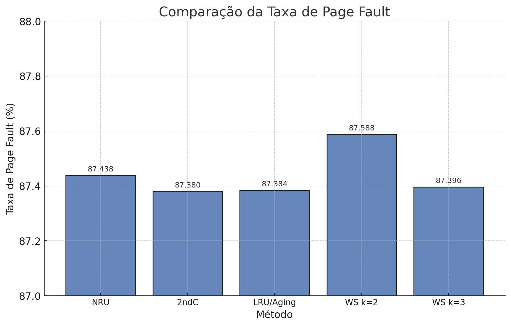
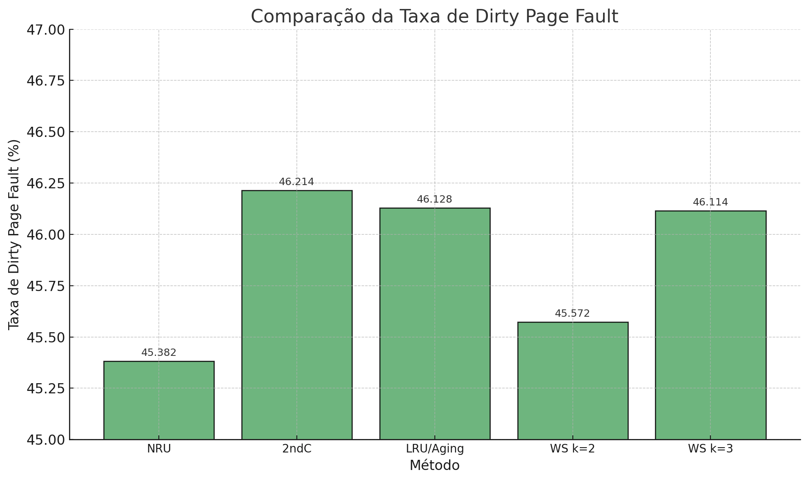
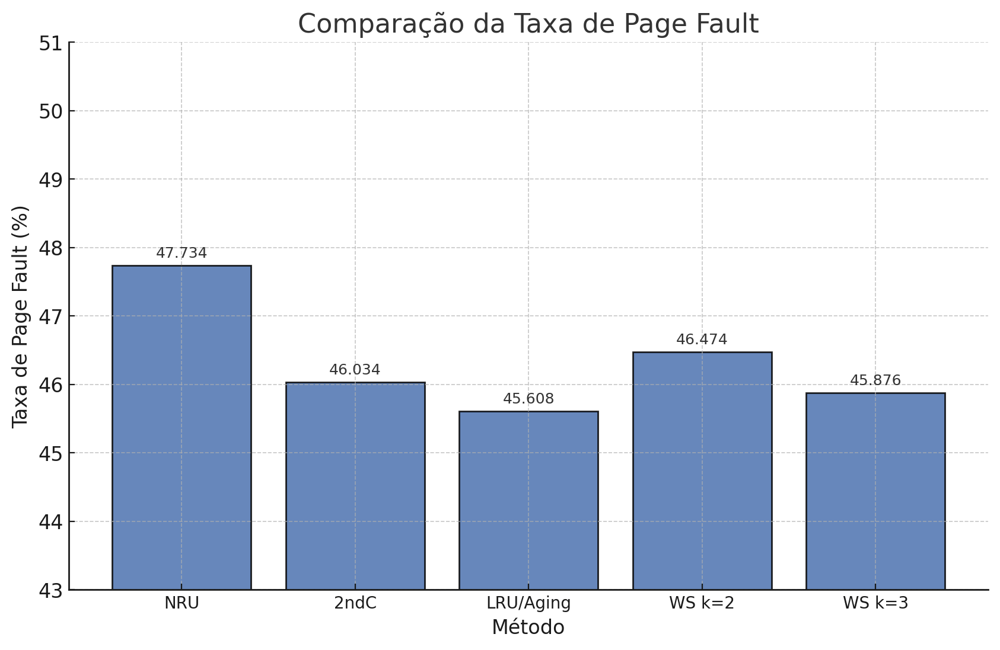
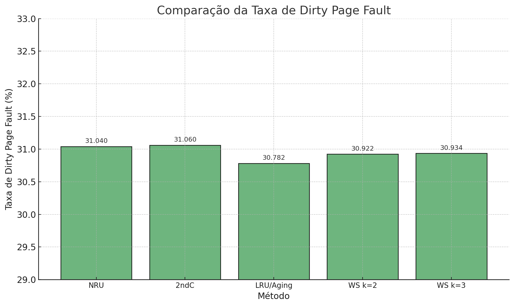

# Relatório T2

## Instruções

**OBS:** Nossa definição de rodada é uma execução inteira do loop principal do simulador, ou seja, um acesso de página para cada processo, totalizando quatro acessos.

1. Ajustar parâmetros no [types.h](types.h)

2. Compilar: `make`

3. Gerar listas de acesso: `./pagelist_gen <num rodadas> <% localidade>`

4. Executar simulação: `./vmem_sim <num rodadas> <algoritmo> [<k>]`

- Opções de algoritmo: NRU, 2ndC, LRU, WS

## Arquitetura e artefatos

### pagelist_gen

Fizemos um gerador de listas de acesso à páginas que suporta um parâmetro adicional de localidade. O parâmetro de localidade define uma chance em porcentagem do acesso seguinte ser uma página "local" (igual, +1 ou -1 do último acesso), ao invés de aleatório, simulando o comportamento de localidade de um processo.

Em nossos testes, comparamos o acesso aleatório (0%) pedido e também um alto grau de localidade (80%).

O nome dos arquivos de output pode ser alterado em types.h.

### procs_sim

Nosso programa que simula quatro processos foi criado conforme especificado. Utilizamos quatro pipes, um para cada processo, para enviar os pedidos de leitura e escrita ao processo vmem_sim, que é nosso simulador. A sincronização para manter a ordem de execução em round-robin foi feita com semáforos.

O procs_sim é executado automaticamente pelo vmem_sim com um fork, transmitindo parâmetros através de variáveis de ambiente.

### types

Tipos e definições de configuração utilizados no projeto.

### util

Estruturas de dados e funções auxiliares que costumamos reutilizar entre trabalhos. Nesse caso, apenas funções de print e as estruturas e funções de acesso para Queue e Set.

### vmem_helpers

Getters e setters para reduzir a complexidade do código principal, como acabamos utilizando arrays separadas para os quatro processos (`table_P1[entries]`, `table_P2[entries]`...) em vez de uma única array de arrays desde o início.

### vmem_sim

Os algoritmos NRU e 2ndC foram implementados conforme os slides, utilizando categorias de prioridade com os bits das flags e uma fila circular de páginas acessadas, respectivamente. A frequência de limpeza dos bits de referência pode ser ajustada no types.h.

Para o LRU/Aging, utilizamos um vetor de bits representando a age, que é atualizado periodicamente utilizando os bits de referência.

Para o Working Set(k), utilizamos um contador global de clock para comparar a age dos processos, de forma que cada processo em memória guarda o valor do clock em que foi acessado por último. O set em si é uma estrutura de dados reaproveitada da disciplina de EDA.

> É importante notar que não faz sentido aplicar o Working Set(**k**) para um **k** tal que seja maior ou igual a menor quantidade de page frames que algum processo possui, pois assim não haveriam candidados para swap, como o WS inteiro já estaria em memória no caso de **k** páginas distintas. Por isso, assim que a memória principal lota, realizamos uma checagem para verificar se faz sentido executar o WS(k) para a distribuição de page frames resultante.

O funcionamento do vmem_sim consiste em ler os pipes do procs_sim em loop e tratar a requisição de acesso de página de cada processo. A função `handle_vmem_io_request()` recebe a requisição e atualiza as estruturas de dados internas e tabela de páginas dos processos conforme necessário, além de verificar se houve um page fault, chamando a função do algoritmo selecionado para tratar o mesmo.

## Resultados da simulação

Analisamos 1000 rodadas em todos os cenários, considerando a média de 10 execuções com listas de páginas distintas. As listas de páginas utilizadas nos resultados geram uma distribuição homogênea de molduras de páginas entre os processos, como por exemplo 4-4-4-4 para nossa RAM de 16 molduras.

Sobre parâmetros, utilizamos um intervalo de clear dos bits de referência de 4 rounds para o NRU, pois aparenta produzir os melhores resultados. Para o LRU/Aging, a limpeza dos bits de referência e shift do vetor de bits de age é feito ao fim de cada round. Para o Working Set, testamos com k=2 e k=3.

### Acesso aleatório

Pelos resultados, o Second Chance aparenta ser o melhor algoritmo para minimizar page faults, entretanto o pior para minimizar dirty faults. Isso é consistente com o fato de que ele não leva páginas modificadas em consideração, ao contrário do Not Recently Used, que utiliza o bit de modified em suas categorias de prioridade de swap, e portanto ficou com a menor taxa de dirty faults.

O LRU ficou bem similar ao WS para k=3, pois os dois utilizam mecanismos similares de aging.

### Acesso com 80% de localidade

Com localidade simulada, observamos que o LRU/Aging passou a ser o melhor algoritmo em questão de page faults, e o NRU pior. Todos ficaram muito próximos em questão de dirty faults, ao contrário do resultado com acesso aleatório, entretanto o Second Chance permanece o pior em dirty faults.

O Working Set k=3 também permanece melhor que o k=2.
